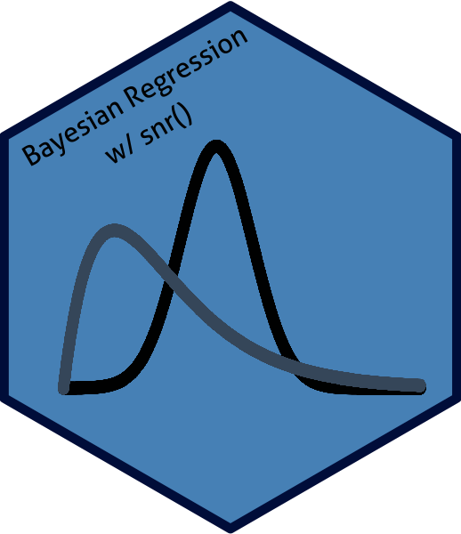

<!-- README.md is generated from README.Rmd. Please edit that file -->

```{r, include = FALSE}
knitr::opts_chunk$set(
  collapse = TRUE,
  comment = "#>"
)
```



# bayes-regression-report 


This project attempts to automate and greatly simplify the process of conducting a Bayesian Simple Normal Regression in R, allowing users to generate an entire customized analysis--including information such as model quality, proposed regression lines, posterior predictions, and more--using only a single line of code.


## Dependencies

In order for the regression report to function properly, users must first ensure that the following packages are installed in their RStudio:


Available on CRAN:

* `tidyverse`
* `rstanarm`
* `bayesplot`
* `reshape2`
* `janitor`
* `kableExtra`

Available on GitHub:

* `bayesrules` ("mdogucu/bayesrules")

The following code can be used to install all of the dependencies at once.

```{r, eval = FALSE}

# install.packages("remotes") ---- if you do not already have this package installed

install.packages(c("tidyverse", "rstanarm", "bayesplot", "reshape2", "janitor", "kableExtra"))

remotes::install_github("mdogucu/bayesrules")

```

## Report Features

The report created by the `snr()` function contains a variety of different sections summarizing different aspects of the provided model. These are:

1. **Analysis Inputs:** summary of the inputs provided for the report
2. **Plot of X & Y:** a scatterplot of the `x` and `y` variables
3. **Visual Diagnostics:** trace plots and chain density overlay plots to check the quality of the model
4. **Posterior Summary Statistics and Mathematical Diagnostics:** mean regression equation provided by the model, plus some mathematical (non-visual) diagnostics--number of effective iterations and variability across vs. within chains--to further check model quality.
5. **Credible Intervals:** this section shows credible intervals (of specified level) for each of the main parameters of interest-- intercept, slope, and deviation.
6. **Plot of Potential Regression Lines Determined By Model:** visual plot showing a sample of regression lines found in the `stan` model on top of the original data.
7. **Posterior Probability of Calculated Slope:** the probability of the true posterior slope being in the direction it was found to be by the model (e.g. if the calculated slope is positive, the probability that the true slope is positive. If the calculated slope is negative, the probability that the true slope is negative.) This provides a sort of hypothesis test for the model.
8. **Evaluating Prediction Quality:** this section considers three different methods (two visual and one mathematical) to help analyze the quality of predictions that can be produced by the calculated model. 


## Operating the Report

Once all of the required dependencies are installed, take the following steps to install the report software:

1. Clone and open this GitHub repository locally.
2. Run the all the code in the file `SNR_function.R`.
3. Load your dataset in your environment.
4. Identify the explanatory varible `x` and response variable `y` that you would like to use.
5. Run the `snr()` function (see examples below) and specify your desired parameters.
6. After the function finishes executing, an HTML file should appear. It will be named according to the data and x/y variables that were called in `snr()`. To open this file, click on it and select `View in Web Browser`.

## Customizing the Report Output

The `snr()` function is highly customizable, containing the following user-specifiable parameters:

#### Parameters Which MUST Be Specified

- `data`: the dataset to be used in the analysis. In order for `snr()` to execute properly, this dataset must be saved as an R object.  
- `x`: the x variable to use. Should be a numeric variable. (enter as a character string, e.g. "age")
- `y`: the y variable to use.  Should be a numeric variable. (enter as a character string, e.g. "height")


#### Optional Parameters

- `n_chains`: Number of chains to use in the stan model (DEFAULT: 4 Chains).
- `n_iter`: Number of iterations to use in the stan model (DEFAULT: 5000 Iterations).
- `ci_pct`: The certainty level (percentage) to use when creating Credible Intervals for the parameters of interest--intercept, slope, and deviation--entered as a whole number (DEFAULT: 95 (95%)).
- `n_lines`: Number of proposed regression lines determined by the model to visualize. (DEFAULT: 1/4 the number of rows in provided dataset.)
- `pred`: Values of the `x` variable to use for posterior prediction of `y`. Accepts a vector for multiple values. (DEFAULT: An empty vector. No predictions are made unless specified by the user).
- `n_folds`: Number of folds for Cross Validation checks (DEFAULT: 10 Folds).

## Example Uses

In this section, we'll consider several examples of how the `snr()` function can be used on real data. We've included two datasets to help illustrate this: `bikes.csv`, which contains information about bikeshare rentals in Washington, D.C. and `penguins.csv`, which contains details about penguins in Antarctica.

#### Example 1: Predicting Bikeshare Ridership Based on Temperature

In the first example, let's say that we want to use the `bikes` data to predict the number of riders using the D.C. bikeshare service on any given day (`rides`, our `y` variable) based on the temperature it feels like outside (`temp_feel`, our `x` variable). 

We also want to specify a few other things:

* We'd like to use 1000 iterations for each chain
* We want 90% credible intervals for our parameters
* We want to plot 10 potential regression lines
* We want to run some specific predictions. Let's say, trying to see the potential ridership on days where the temperature it feels like outside is 60 degrees and 90 degrees.

Other than that, we're happy with the defaults. To execute this report, we'd use the following code:

```{r, eval = FALSE}

# Read in the data
bikes <- read.csv("bikes.csv")

# Build the report
snr(bikes, x = "temp_feel", y = "rides", n_iter = 1000, ci_pct = 90, n_lines = 10, pred = c(60, 90))


```

The report produced for this example can be found in the HTML file titled `SNR_Results_bikes_temp_feel_rides.html`.

#### Example 2: Predicting Penguin Body Mass Based on Flipper Length

For our next two examples, we're going to use the `penguins` data. Let's say that first, we want to predict penguin body mass (`body_mass_g`, our `y` variable) using flipper length (`flipper_length_mm`, our `x` variable). We also want to make predictions about the body mass of penguins who have flippers of length 190 mm, 200 mm, and 210 mm.

Other than that, we're happy with the defaults and don't want to make any changes to them. To execute this report, we'll run the following code:

```{r, eval = FALSE}

# Read in the data
penguins <- read.csv("penguins.csv")

# Build the report
snr(penguins, x = "flipper_length_mm", y = "body_mass_g", pred = c(190, 200, 210))

```

The report produced for this example can be found in the HTML file titled `SNR_Results_penguins_flipper_length_mm_body_mass_g.html`

#### Example 3: Predicting Penguin Bill Depth Based on Bill Length (Using Too Few Model Iterations)

Finally, let's say we want to predict penguin bill depth (`bill_depth_mm`, our `y` variable) using bill length (`bill_length_mm`, our `x` variable). 

In this example, we're pretty lazy. We don't want to wait a long time for our models to build, but would rather speed up the process. To do so, we decide to seriously cut down the number of iterations to run on our models to just 50 and to drop our cross validation to only 5 folds.

We also decide the following:

* We want 80% credible intervals
* Unlike the other examples, we don't want to run predictions for specific x values

To build this report, we'd use the following code:

```{r, eval = FALSE}

# Read in the data
penguins <- read.csv("penguins.csv")

# Build the report
snr(penguins, x = "bill_length_mm", y = "bill_depth_mm", n_iter = 50, ci_pct = 80, n_folds = 5)

```

The report produced for this example can be found in the HTML file titled `SNR_Results_penguins_bill_length_mm_bill_depth_mm.html`


  