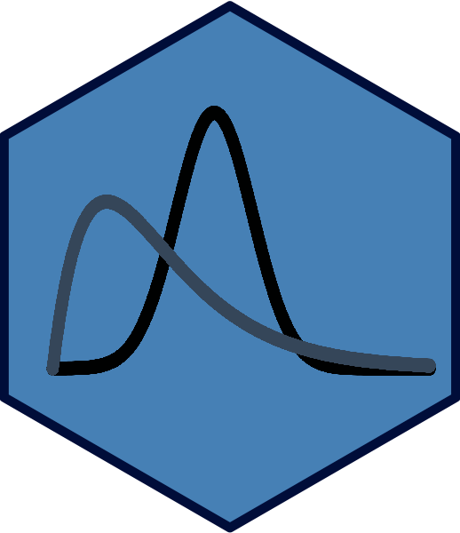

Simple Normal Regression Reports with snr():
================

<!-- README.md is generated from README.Rmd. Please edit that file -->


### Automating the process of analysis Bayes huge dividends by dramatically reducing coding time.

This project attempts to automate and greatly simplify the process of conducting a Bayesian Simple Normal Regression in R, allowing users to generate an entire report containing a fully customized analysis--including information such as model quality, proposed regression lines, posterior predictions, and more--using only a single line of code.

 

> ## What is this and why is it useful?

This project contains two key components:

1.  An R Markdown template file that contains code to generate all the steps of a Bayesian Simple Regression, alongside text and other tools to help make it easily interpretable (`SNR_Template.Rmd`)

2.  A function, called `snr()`, which allows you to pass specific inputs--the details of the model that you want to build, plus some more specifics about what the analysis should look like--to the R Markdown template, generating custom outputs/reports.

The template and function combined allow the user to automate the process of Simple Normal Regression. Rather than writing 100+ lines of code to run each step individually, you can create an entire report using just 1 line.

There are several benefits to this automation process which motivated our choice to build this tool:

-   It allows users to skip the process of writing long code, which can be quite tedious.

-   Automation brings the focus on the underlying concepts, rather than on the details of the coding process.

-   The report structure allows users to see all of the different steps of Bayesian regression in one place. Often, in textbooks and courses, the regression analysis process is taught step by step. While this is very helpful for understanding what is happening in each piece, it can sometimes be hard for students to understand what's happening unless they also get a sense of the bigger picture. Seeing everything about a model in one spot can make it a lot easier to see how the pieces all fit together and get a better sense of the overall quality of your model.

-   Our report contains lots of features to help users interpret their models. For each section, we provide insights as to what you should be looking for and which things you don't want to see in the results. We also have tools like a flagging system, which visually warn users (via colors and warning messages) when their model is low quality. This sort of walkthrough of the analysis process can be really useful in the process of learning Bayesian Simple Normal Regression. Coding the traditional way does not provide that same benefit.

-   It makes it really easy for users to make changes to their models. Rather than looking through 100+ lines of code to find all the lines where they need to edit something to make the desired adjustment, they can just change one parameter in the input function--for example, their x variable--and immediately re-generate their report.

-   Sometimes it can be hard to decide all of the specifics of what you want to see in your output, especially for new users. How many chain iterations should you have? How many folds for cross-validation? What percentage for your credible intervals? That's a lot of decisions, and a lot of people just getting started might have no idea! Using the automation method via a function helps with this indecision by providing meaningful default values. If you only want to provide an x and y variable and your data, that's totally fine! `snr()` will decide a good number of chain iterations and folds, plus a reasonable credible interval percentage, for you!

-   It makes it really easy to compare models side by side. If you want to compare models, just generate a report for one then another report for the next and open them next to each other. Since each report is calculated the exact same way, you can directly compare the identical sections of report and see which model performs better in which aspects.

-   Another cool reason to use our automated reports is for the ease of use. In Bayesian Simple Normal Regression in R, the functions that are used are spread across many packages including `rstan`, `rstanarm`, `bayesplot`, `bayesrules` and data cleaning tools such as the `tidyverse`. By using this report, you don't have to dig into these packages to find the relevant functions and figure out how to use them!

 

> ## What conditions do I need in my dataset for the analysis to work?

Not a lot actually! You just need a dataset that has at least two numeric (i.e. integer or double) variables. One variable is the response and the other, the explanatory variable.

 

> ## How does it work?

Our `snr()` function knits a [parameterized R Markdown report](https://rmarkdown.rstudio.com/developer_parameterized_reports.html%23parameter_types%2F) template file (called `SNR_Template.Rmd`) to generate the analysis.

This report has a special coding style which allows it to accept inputs and produce different outputs depending on what is provided. Rather than looking like traditional code, where all of the variables must be defined (e.g. `ggplot(data = bikes, aes(x = temp_feel, y = rides)) + geom_point()`), the code in this report is written in a way where it can accept variable parameters (e.g. `ggplot(data = params$data, aes_string(x = params$x, y = params$y) + geom_point()`).

When you call the `snr()` function, it passes the arguments you specify to the R Markdown template, which then uses those arguments in its code.

Let's consider the example code from above. If our template contains the code `ggplot(data = params$data, aes_string(x = params$x, y = params$y) + geom_point()` and you call `snr(data = bikes, x = "temp_feel", y = "rides")`, then your template is passed `bikes` for `params$data`, `"temp_feel"` for `params$x`, and `"rides"` for `params$y`, then compiled. As the file is knit, the ggplot code turns into: `ggplot(data = bikes, aes_string(x = "temp_feel", y = "rides")) + geom_point()` and executes just the same way as if you'd run `ggplot(data = bikes, aes(x = temp_feel, y = rides))` in a normal R Markdown file.

`snr()` is really just a wrapper on `rmarkdown::render()`. We created this function so that generating the automated analysis reports is as simple as possible (and so that we can create custom output file names)!

------------------------------------------------------------------------

*Note that `aes_string` in the example just means that the aesthetics accept strings instead of names--parameterized reports don't like to accept data set column names, like `temp_feel`, unless they're structured as strings, `"temp_feel"`.*

 

> ## What do I need to do to install and run it?

#### Dependencies

In order for the regression report to function properly, you must first ensure that the following packages are installed in your RStudio:

Available on CRAN:

-   `bayesplot` \[[CRAN](https://CRAN.R-project.org/package=bayesplot), [GitHub](https://github.com/stan-dev/bayesplot)\]
-   `janitor` \[[CRAN](https://cran.r-project.org/package=janitor), [GitHub](https://github.com/sfirke/janitor)\]
-   `kableExtra` \[[CRAN](https://cran.r-project.org/package=kableExtra), [GitHub](https://github.com/haozhu233/kableExtra)\]
-   `reshape2` \[[CRAN](https://cran.r-project.org/package=reshape2), [GitHub](https://github.com/hadley/reshape)\]
-   `rstanarm` \[[CRAN](https://CRAN.R-project.org/package=rstanarm), [GitHub](https://github.com/stan-dev/rstanarm)\]
-   `tidyverse` \[[CRAN](https://CRAN.R-project.org/package=tidyverse), [GitHub](https://github.com/tidyverse/tidyverse)\]

Available on GitHub:

-   `bayesrules` \[[GitHub](https://github.com/mdogucu/bayesrules)\]

The following code can be used to install all of the dependencies at once.

``` r

# install.packages("remotes") ---- if you do not already have this package installed

install.packages(c("tidyverse", "rstanarm", "bayesplot", "reshape2", "janitor", "kableExtra"))

remotes::install_github("mdogucu/bayesrules")
```

#### Operating the Report

Once all of the required dependencies are installed, you can start building reports using the following steps:

1.  Clone and open this GitHub repository locally.

2.  Run the all the code in the file `SNR_function.R`. This file contains the definition for the `snr()` function used to generate reports.

3.  Load the dataset that you want to run regression on into your `R` environment.

4.  Identify the explanatory variable `x` and response variable `y` that you would like to use.

5.  Run the `snr()` function (see examples below) and specify your desired parameters.

6.  After the function finishes executing, an HTML file containing your report should appear. It will be named according to the data and x/y variables that were called in `snr()`. To open this file, click on it and select `View in Web Browser`.

 

> ## What kind of output can I expect in the report?

The report created by the `snr()` function contains a variety of different sections summarizing different aspects of the provided model. These are:

1.  **Analysis Inputs:** summary of the inputs provided for the report

2.  **Plot of X & Y:** a scatterplot of the `x` and `y` variables

3.  **Visual Diagnostics:** trace plots and chain density overlay plots to check the quality of the model

4.  **Posterior Summary Statistics and Mathematical Diagnostics:** mean regression equation provided by the model, plus some mathematical (non-visual) diagnostics--number of effective iterations and variability across vs. within chains--to further check model quality.

5.  **Credible Intervals:** this section shows credible intervals (of specified level) for each of the main parameters of interest-- intercept, slope, and deviation.

6.  **Plot of Potential Regression Lines Determined By Model:** visual plot showing a sample of regression lines found in the `stan` model on top of the original data.

7.  **Posterior Probability of Calculated Slope:** the probability of the true posterior slope being in the direction it was found to be by the model (e.g. if the calculated slope is positive, the probability that the true slope is positive. If the calculated slope is negative, the probability that the true slope is negative.) This provides a sort of hypothesis test for the model.

8.  **Evaluating Prediction Quality:** this section considers three different methods (two visual and one mathematical) to help analyze the quality of predictions that can be produced by the calculated model.

 

> ## How can I customize my reports to show what I want?

The `snr()` function is highly customizable, containing the following user-specifiable parameters:

#### Parameters Which MUST Be Specified

-   `data`: the dataset to be used in the analysis. In order for `snr()` to execute properly, this dataset must be saved as an R object.

-   `x`: the x variable to use. Should be a numeric variable. (enter as a character string, e.g. "age")

-   `y`: the y variable to use. Should be a numeric variable. (enter as a character string, e.g. "height")

#### Optional Parameters

-   `n_chains`: Number of chains to use in the stan model (DEFAULT: 4 Chains).

-   `n_iter`: Number of iterations to use in the stan model (DEFAULT: 5000 Iterations).

-   `ci_pct`: The certainty level (percentage) to use when creating Credible Intervals for the parameters of interest--intercept, slope, and deviation--entered as a whole number (DEFAULT: 95 (95%)).

-   `n_lines`: Number of proposed regression lines determined by the model to visualize. (DEFAULT: Whichever value is smaller--1/4 the number of rows in provided dataset or 1/2 the number of iterations)

-   `pred`: Values of the `x` variable to use for posterior prediction of `y`. Accepts a vector for multiple values. (DEFAULT: An empty vector. No predictions are made unless specified by the user).

-   `n_folds`: Number of folds for Cross Validation checks (DEFAULT: 10 Folds).

 

> ## What are some examples of how this might be used?

In this section, we'll consider several examples of how the `snr()` function can be used on real data. We've included two datasets to help illustrate this: `bikes.csv`, which contains information about bikeshare rentals in Washington, D.C. and `penguins.csv`, which contains details about penguins in Antarctica. Both of these datasets are located in the `Examples` folder.

#### Example 1: Predicting Bikeshare Ridership Based on Temperature

In the first example, let's say that we want to use the `bikes` data to predict the number of riders using the D.C. bikeshare service on any given day (`rides`, our `y` variable) based on the temperature it feels like outside (`temp_feel`, our `x` variable).

We also want to specify a few other things:

-   We'd like to use 1000 iterations for each chain
-   We want 90% credible intervals for our parameters
-   We want to plot 10 potential regression lines
-   We want to run some specific predictions. Let's say, trying to see the potential ridership on days where the temperature it feels like outside is 60 degrees and 90 degrees.

Other than that, we're happy with the defaults. To execute this report, we'd use the following code:

``` r

# Read in the data
bikes <- read.csv("bikes.csv")

# Build the report
snr(bikes, x = "temp_feel", y = "rides", n_iter = 1000, ci_pct = 90, n_lines = 10, pred = c(60, 90))
```

The report produced for this example can be found the `Examples` folder under the HTML file titled `SNR_Results_bikes_temp_feel_rides.html`.

#### Example 2: Predicting Penguin Body Mass Based on Flipper Length

For our next two examples, we're going to use the `penguins` data. Let's say that first, we want to predict penguin body mass (`body_mass_g`, our `y` variable) using flipper length (`flipper_length_mm`, our `x` variable). We also want to make predictions about the body mass of penguins who have flippers of length 190 mm, 200 mm, and 210 mm.

Other than that, we're happy with the defaults and don't want to make any changes to them. To execute this report, we'll run the following code:

``` r

# Read in the data
penguins <- read.csv("penguins.csv")

# Build the report
snr(penguins, x = "flipper_length_mm", y = "body_mass_g", pred = c(190, 200, 210))
```

The report produced for this example can be found in the HTML file titled `SNR_Results_penguins_flipper_length_mm_body_mass_g.html`

#### Example 3: Predicting Penguin Bill Depth Based on Bill Length (Using Too Few Model Iterations)

Finally, let's say we want to predict penguin bill depth (`bill_depth_mm`, our `y` variable) using bill length (`bill_length_mm`, our `x` variable).

In this example, we're pretty lazy. We don't want to wait a long time for our models to build, but would rather speed up the process. To do so, we decide to seriously cut down the number of iterations to run on our models to just 50 and to drop our cross validation to only 5 folds.

We also decide the following:

-   We want 80% credible intervals
-   Unlike the other examples, we don't want to run predictions for specific x values

To build this report, we'd use the following code:

``` r

# Read in the data
penguins <- read.csv("penguins.csv")

# Build the report
snr(penguins, x = "bill_length_mm", y = "bill_depth_mm", n_iter = 50, ci_pct = 80, n_folds = 5)
```

The report produced for this example can be found in the HTML file titled `SNR_Results_penguins_bill_length_mm_bill_depth_mm.html`

 

> ## What report features should I look out for?

In addition to variation based on user input, the HTML files created by `snr()` can also vary based on the results of the analysis. Here are a few cool ways in which you can see this behavior:

#### Red Flags

The mathematical diagnostics sections `Number of Effective Iterations` and `Variability Across vs Within Chains` warn the user when the diagnostics reported within are outside of the boundaries for what can be considered good quality.

-   Each of these two sections contains a table summarizing certain measures of model quality. Each table has a column that contains a Yes/No marker stating whether each row is within a certain threshold or whether it exceeds it. When a row exceeds the threshold, it highlights in bold red.

-   For each of the two tables, if any of the rows end up highlighting in red because they exceed the threshold, an additional warning message is output, providing instructions (and a word of caution) to the user.

This behavior can be seen in the output file for the third example above! In this example, too few iterations are used, resulting in a low quality model. Both mathematical diagnostics tables have rows highlighted in red and both display the corresponding warning message. If you look at any of the other examples, where the models are high quality, there will be no red rows or warning messages.

> How were the boundaries determined?

To determine the boundaries/thresholds for model quality, we used the guidelines discussed in Chapter 6 of the *Bayes Rules* textbook written by Drs. Alicia Johnson, Miles Ott, and Mine Dogucu (Chapters 1-5 are currently available [here](https://www.bayesrulesbook.com) and additional chapters will be available in the future).

In this book, the authors argue for the following thresholds:

1.  We should probably be suspicious of Markov chains for which `N_eff` is less than 10% of the actual sample size `N`.

2.  `R_hat` ratios bigger than 1.05 indicate that we should be concerned about the stability of the simulation.

Our flagging system uses the same limits. `N_eff` rows highlight red if `N_eff` is less than 10% of the combined number of iterations across all of our chains and `R_hat` rows highlight red if their `R_hat` value is &gt; 1.05.

#### Slope Direction

The `Posterior Probability of Calculated Slope` section determines the direction of the provided slope and uses that information to determine which test it should run, i.e. should it test for the probability of a positive or negative slope?

You can see this difference when comparing the output from example three and example two. In example two, the calculated slope is positive. Therefore the report tests for the probability of receiving a positive slope. However, in example three, the calculated slope is negative. This time, you can see that the report tests for the probability of receiving a negative slope.

#### Posterior Prediction

For the `Posterior Predictions` section (an optional section which appears only if the user specifically calls it), the report analyzes the distributions calculated for each prediction and finds the most likely value. It then plots this value with a line and reports it below the plot.

If you look at the first two example reports, which both contain posterior predictions, you can see that the graphs all have different most likely values plotted and listed.

 

> ## Why can I not do multiple regression with this tool?

Extending this software to be able to handle multiple regression is not a particularly complicated task. However, several factors have led us to the decision of sticking purely with simple regression for the moment:

1.  Simple regression allows us to include more visual plots that help us understand our model since we are only looking at data in two dimensions. A lot of the visual plots in the report would not be possible with multiple regression. Since we are focused in this project in showing a wide variety of ways to visualize and analyze Bayesian regression results, we thought that simple regression provided the best way to do so.

2.  For every dimension added to the input model, computation time necessary to produce the report increases at an exponential rate. This project is intended purely to be a proof of concept to show that the automation of Bayesian analysis can be done in a very simple and user-friendly way. Since the code for multiple regression is so similar, extending the project to more dimensions would not add anything in terms of proof of concept, but it would add a huge amount of time and frustration to the testing process.

**If you would like to see a multiple regression version added, though, please let us know. If there is enough interest, we will certainly consider adding it to this project!**

------------------------------------------------------------------------

#### Contributors

Project Co-Creators:

-   [Audrey Bertin](https://github.com/ambertin)
-   [Marium Tapal](https://github.com/mariumtapal)
